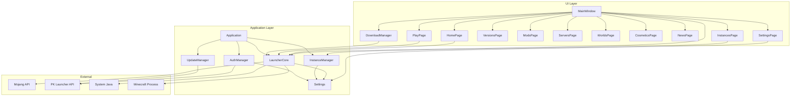
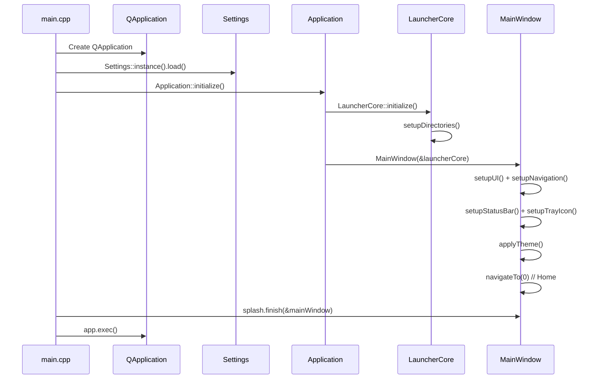
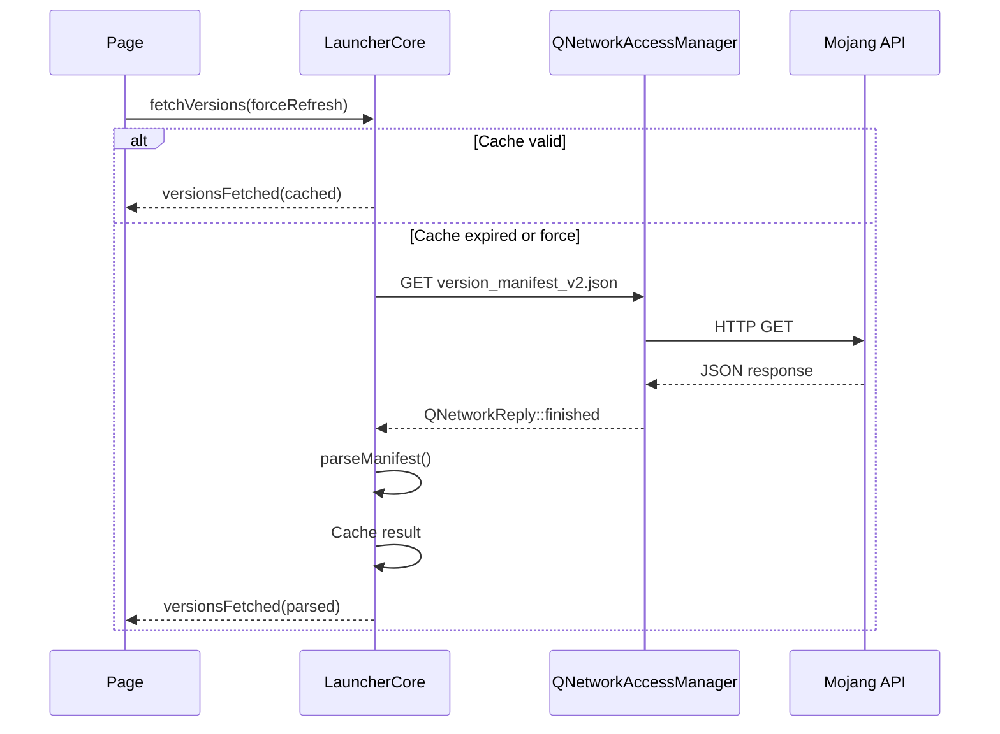
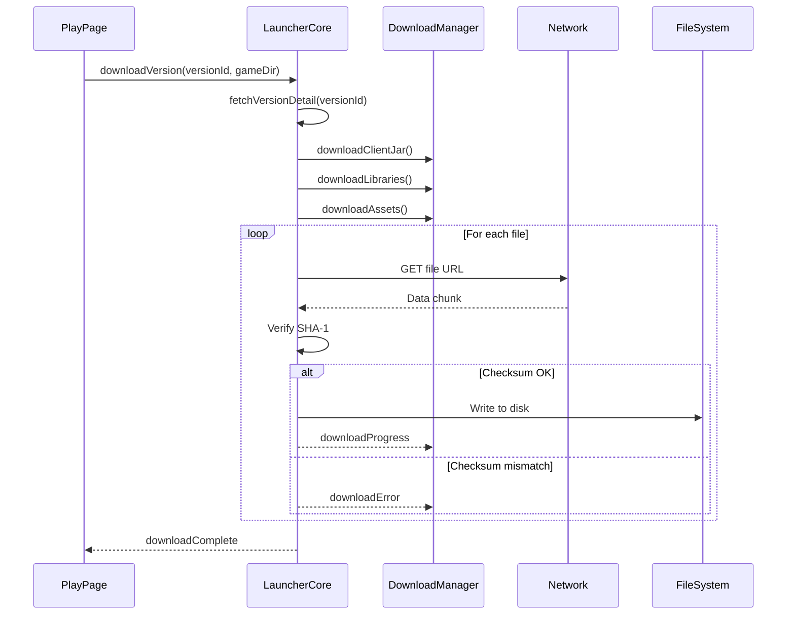
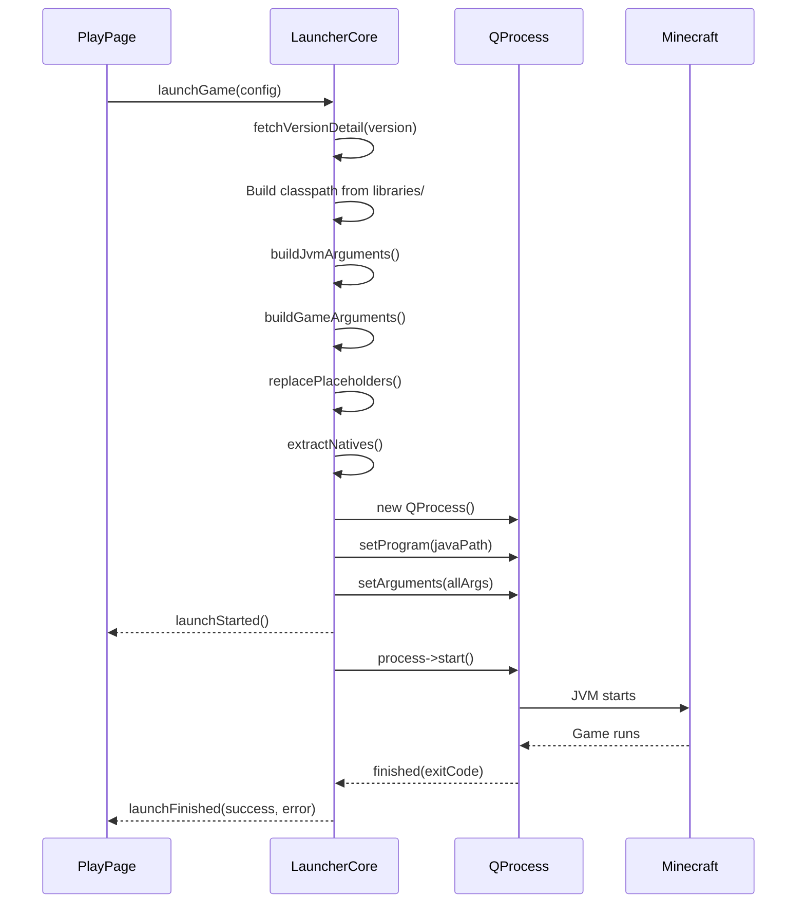
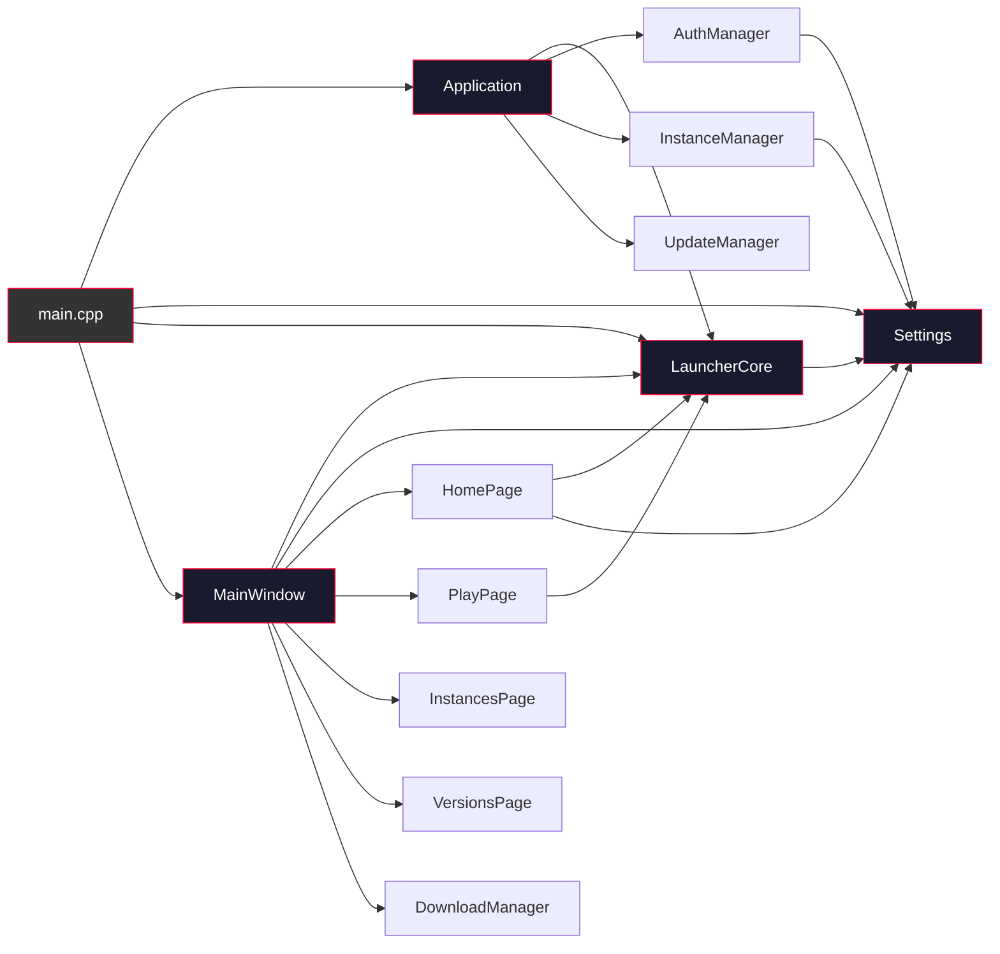
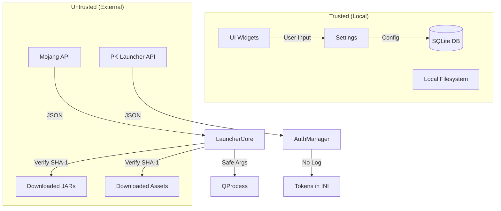

# ARCHITECTURE.md — PkLauncher System Architecture

> **CURRENT** = Implemented in code. **PLANNED** = Designed but not yet coded. **PROPOSED** = Under discussion.

---

## High-Level Component Map



---

## Component Details

### Application Layer

#### `Application` (src/core/Application.cpp)
**Status: CURRENT** — Implemented.

Central coordinator. Owns and initializes all managers. Provides accessors for `LauncherCore`, `AuthManager`, `InstanceManager`, `UpdateManager`. Handles lifecycle (initialize → run → shutdown).

**Owned by**: Agent-2 (Core Services)

#### `Settings` (src/core/Settings.cpp)
**Status: CURRENT** — Implemented.

Singleton (`Settings::instance()`). Loads/saves `settings.json` to `QStandardPaths::AppConfigLocation`. Provides getters/setters for Java paths, JVM args, launcher behavior, proxy, appearance. Creates required directories on construction.

**Owned by**: Agent-4 (Data & Persistence)

#### `LauncherCore` (src/launcher/LauncherCore.cpp)
**Status: CURRENT** (partial) — Major logic implemented, download pipeline incomplete.

The heart of the launcher. Responsibilities:
- **Version manifest**: Fetch from Mojang, parse, cache with TTL (5 min).
- **Version details**: Fetch per-version JSON, parse libraries/assets/arguments.
- **Java detection**: Scan JAVA_HOME, common paths, PATH; parse version output.
- **Java validation**: Run `java -version` and check exit code.
- **JVM arguments**: Build version-specific args (Java 8/11/17/21).
- **Game arguments**: Build from version JSON with placeholder replacement.
- **Process launch**: Construct QProcess with safe argument list.
- **Downloads**: Structure exists but actual download/verify not implemented.

**Owned by**: Agent-2 (Core Services)

#### `InstanceManager` (src/launcher/InstanceManager.cpp)
**Status: CURRENT** — Full CRUD implemented.

SQLite-backed instance management. Uses named connection `"instances"`. Schema: `instances` table with id, name, version, loader, ram_mb, jvm_args, game_dir, timestamps, play_time.

**Owned by**: Agent-4 (Data & Persistence)

#### `AuthManager` (src/core/AuthManager.cpp)
**Status: CURRENT** (partial) — API calls implemented, needs real backend.

Handles email/password login, registration, token refresh, logout. Stores tokens in `auth.ini` via QSettings. On startup, loads tokens and fetches user profile from `/auth/me`.

**Owned by**: Agent-4 (Data & Persistence)

#### `UpdateManager` (src/core/UpdateManager.cpp)
**Status: CURRENT** — Update check and download implemented.

Checks `https://releases.pklauncher.dev/update.json` with platform suffix. Compares versions with `QVersionNumber`. Downloads update, verifies SHA-256, saves to temp file.

**Owned by**: Agent-2 (Core Services)

---

### UI Layer

#### `MainWindow` (src/ui/MainWindow.cpp)
**Status: CURRENT** — Fully implemented.

Main application window. Features:
- Left sidebar navigation (10 pages) with dark theme + red accent.
- `QStackedWidget` for page switching.
- Top toolbar with title and window controls.
- Status bar with download progress.
- System tray integration (minimize to tray, double-click restore).
- Dark theme applied via Qt Style Sheets.

**Owned by**: Agent-3 (UI/UX)

#### `DownloadManager` (src/ui/DownloadManager.cpp)
**Status: CURRENT** — UI implemented.

Widget showing active/completed downloads with per-item progress bars and overall progress. Connected to `LauncherCore::downloadProgress` signal.

**Owned by**: Agent-3 (UI/UX)

#### Pages

| Page | Status | Owner |
|------|--------|-------|
| `HomePage` | **CURRENT** — Fully built with hero, play button, telemetry cards | Agent-3 (UI/UX) |
| `PlayPage` | **STUB** — Label only, needs instance selection + launch UI | Agent-3 (UI/UX) |
| `InstancesPage` | **STUB** — Label only, needs CRUD UI | Agent-3 (UI/UX) |
| `VersionsPage` | **STUB** — Label only, needs version list + download UI | Agent-3 (UI/UX) |
| `ModsPage` | **STUB** — Label only | Agent-3 (UI/UX) |
| `ServersPage` | **STUB** — Label only | Agent-3 (UI/UX) |
| `WorldsPage` | **STUB** — Label only | Agent-3 (UI/UX) |
| `CosmeticsPage` | **STUB** — Label only | Agent-3 (UI/UX) |
| `NewsPage` | **STUB** — Label only | Agent-3 (UI/UX) |
| `SettingsPage` | **STUB** — Label only, needs full settings UI | Agent-3 (UI/UX) |

---

## Data Flow

### Application Startup


### Version Fetch Flow (CURRENT)


### Download Flow (PLANNED)


### Launch Flow (CURRENT, partial)


---

## Module Dependency Graph



---

## Key Classes and Their Responsibilities

### Structs (Data Types)

| Struct | File | Purpose |
|--------|------|---------|
| `VersionEntry` | LauncherCore.h | Version manifest entry (id, type, url, releaseTime) |
| `VersionDetail` | LauncherCore.h | Full version info (mainClass, libraries, assets, args) |
| `JavaInfo` | LauncherCore.h | Java installation info (path, version, majorVersion, is64Bit) |
| `LaunchConfig` | LauncherCore.h | Game launch parameters (username, uuid, javaPath, args) |
| `DownloadProgress` | LauncherCore.h | Download status (currentFile, bytes, counts) |
| `InstanceInfo` | InstanceManager.h | Instance metadata (id, name, version, ram, gameDir) |
| `UserProfile` | AuthManager.h | User info (id, email, username, premium, coins) |
| `UpdateInfo` | UpdateManager.h | Update metadata (version, url, sha256, mandatory) |
| `DownloadItem` | DownloadManager.h | Download list item (name, url, progress) |
| `NavItem` | MainWindow.h | Navigation entry (label, icon, pageIndex) |

### Key Signals

| Class | Signal | Purpose |
|-------|--------|---------|
| `LauncherCore` | `versionsFetched(QList<VersionEntry>)` | Version list ready |
| `LauncherCore` | `versionDetailFetched(VersionDetail)` | Version detail ready |
| `LauncherCore` | `javaDetected(QList<JavaInfo>)` | Java scan complete |
| `LauncherCore` | `downloadProgress(DownloadProgress)` | Download status update |
| `LauncherCore` | `downloadComplete(QString)` | Download finished |
| `LauncherCore` | `downloadError(QString)` | Download failed |
| `LauncherCore` | `launchStarted()` | Game process started |
| `LauncherCore` | `launchFinished(bool, QString)` | Game process ended |
| `LauncherCore` | `logMessage(QString)` | Debug/status message |
| `InstanceManager` | `instanceCreated(InstanceInfo)` | Instance created |
| `InstanceManager` | `instanceDeleted(QString)` | Instance deleted |
| `InstanceManager` | `instanceUpdated(InstanceInfo)` | Instance updated |
| `AuthManager` | `loginSuccess(UserProfile, QString)` | Login succeeded |
| `AuthManager` | `loginFailed(QString)` | Login failed |
| `Settings` | `settingsChanged()` | Settings modified |

---

## Security Boundaries



**Rules**:
1. All external JSON is parsed and validated before use.
2. Downloaded files are SHA-1 verified before extraction/execution.
3. Process arguments are built as `QStringList`, never shell strings.
4. Tokens are stored in `QSettings` INI, never logged.
5. User input is validated before use in paths or API calls.

---

## Build System

### CMake Structure
```
CMakeLists.txt          — Root: project definition, Qt6 packages, sources, tests option
  PkLauncherLib         — Static library of all src/ (excluding main.cpp)
  PkLauncher            — Main executable (main.cpp + resources + links PkLauncherLib)
  tests/CMakeLists.txt  — Test targets (when BUILD_TESTS=ON)
```

### Build Commands
```bash
# Full build with tests
mkdir -p build && cd build
cmake .. -DCMAKE_BUILD_TYPE=Release -DBUILD_TESTS=ON -DCMAKE_EXPORT_COMPILE_COMMANDS=ON
cmake --build . --parallel $(nproc)

# Run tests
ctest --output-on-failure

# Build without tests
cmake .. -DCMAKE_BUILD_TYPE=Release
cmake --build . --parallel $(nproc)
```

### Compiler Flags
- GCC/Clang: `-Wall -Wextra -Wpedantic -Werror`
- MSVC: `/W4 /WX`

---

## File Ownership Map

| Agent | Owned Directories/Files |
|-------|------------------------|
| Agent-1 (Architect) | `AGENTS.md`, `PROJECT.md`, `ARCHITECTURE.md`, `TASKS.md`, `STATUS.md`, `COMMUNICATION.md`, `DECISIONS.md`, `agents/` |
| Agent-2 (Core Services) | `src/launcher/`, `include/launcher/`, `src/core/Application.cpp`, `include/core/Application.h`, `src/core/UpdateManager.cpp`, `include/core/UpdateManager.h`, `src/network/`, `CMakeLists.txt` |
| Agent-3 (UI/UX) | `src/ui/`, `include/ui/`, `resources/`, `Design.md` |
| Agent-4 (Data & Persistence) | `src/core/Settings.cpp`, `include/core/Settings.h`, `src/core/AuthManager.cpp`, `include/core/AuthManager.h`, `src/launcher/InstanceManager.cpp`, `include/launcher/InstanceManager.h` |
| Agent-5 (Quality & Integration) | `tests/`, `.clang-format`, `.gitignore` |

> **Note**: `src/main.cpp` is shared infrastructure. Agent-2 owns it but Agent-5 may touch it for test harness needs. Always coordinate.
